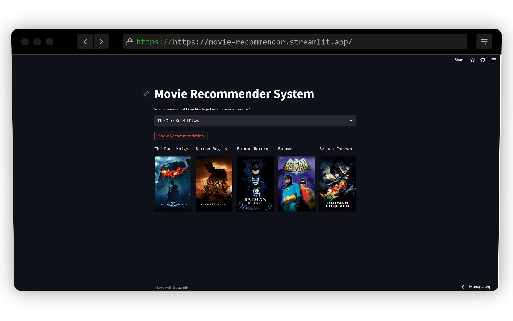

# 🎥 Movie Recommendation System 


## 📝 About
This project is a movie recommendation system that uses the [TMDB 5000 Movie](https://www.kaggle.com/datasets/tmdb/tmdb-movie-metadata) dataset. The dataset contains information about 5000 movies, including user ratings, budget, revenue, and genres. The recommendation system uses the cosine similarity to find the similarity between movies based on their genres, keywords, cast, and crew. The system then recommends the top 5 most similar movies to the user.

## ⚙️ Technologies Used
- Python
- Streamlit

## 🔍 Features
- Recommends movies based on user input.

## 🔨 Installation

### Clone
Clone this repository to your local machine
```
$ git clone
```
```
$ cd movie-recommendation-system
```
```
$ pip install -r requirements.txt
```
### Usage
```
$ streamlit run app.py
```

## 📜 License
[](https://opensource.org/licenses/MIT)

